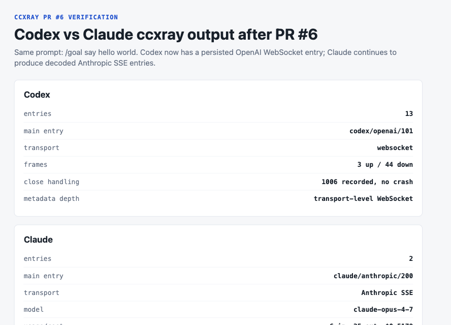
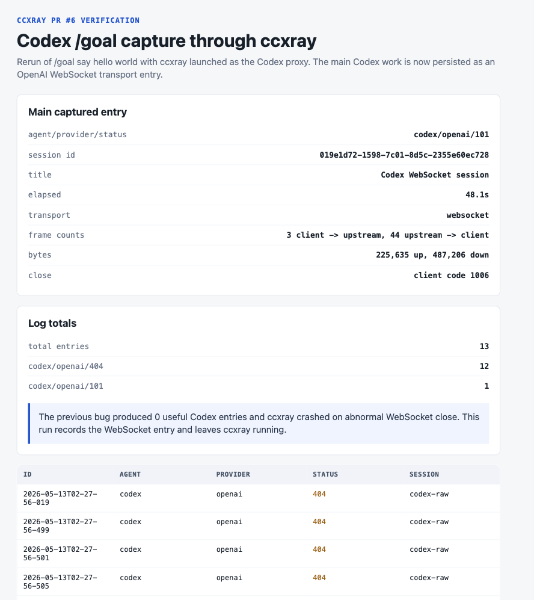
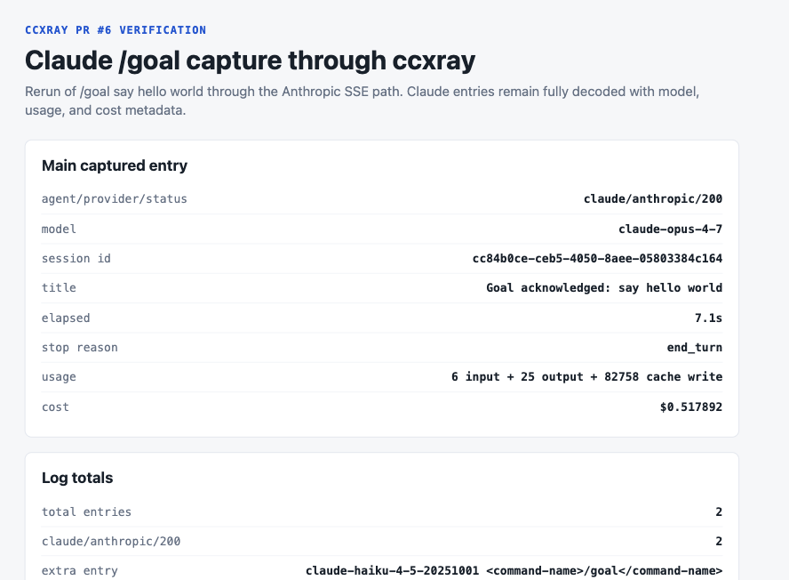

# Codex vs Claude in ccxray after PR #6

This post compares how `ccxray` observes Claude Code and Codex when both run the same agent command:

```text
/goal say hello world
```

The comparison uses PR #6 as the baseline:

```text
https://github.com/shhtheonlyperson/ccxray/pull/6
```

That matters because PR #6 changes the Codex path from "completed locally but effectively invisible in ccxray" to "captured reliably as an OpenAI WebSocket transport entry."

The short version:

- Claude Code is decoded at the semantic API-event layer.
- Codex is now captured reliably at the WebSocket transport layer.
- These are both useful, but they are not equivalent levels of observability yet.

## What ccxray supports today

`ccxray` started as a transparent proxy for Claude Code and Anthropic traffic. The original happy path was simple:

```text
Claude Code -> ccxray -> Anthropic /v1/messages SSE
```

In that world, ccxray can read the request body, parse Anthropic SSE response events, calculate usage/cost, and render a rich dashboard timeline.

Codex requires a broader model:

```text
Codex -> ccxray -> OpenAI Responses WebSocket
```

In the Codex path, the main turn is not a normal JSON response or Anthropic-style SSE stream. It is a WebSocket upgrade followed by bidirectional frames. PR #6 makes that path observable and stable, but it intentionally stops at transport-level capture.

That transport-first approach is the right baseline: first prove the turn flowed through ccxray and did not crash the proxy; then add semantic frame parsing in a later layer.

## Test setup

Both runs used the same prompt:

```text
/goal say hello world
```

The comparison below comes from saved ccxray log homes:

```text
Codex:  /tmp/ccxray-goal-compare-codex-final
Claude: /tmp/ccxray-goal-compare-claude
```

The screenshots in this folder are evidence views generated from those captured ccxray logs. They are not hand-written mock data.

## High-level comparison



| Dimension | Codex after PR #6 | Claude |
| --- | --- | --- |
| Main ccxray entry | `codex/openai/101` | `claude/anthropic/200` |
| Primary transport | OpenAI Responses WebSocket | Anthropic SSE |
| Entry count in the run | 13 total | 2 total |
| Useful main entry | 1 WebSocket transport entry | 2 decoded SSE entries |
| Model in ccxray | Not decoded yet | `claude-opus-4-7`, plus Haiku hook |
| Usage/cost in ccxray | Not decoded yet | Decoded |
| Close/error behavior | Captures observed abnormal close `1006` without crashing | Normal HTTP/SSE completion |
| Current observability depth | Transport-level | Semantic message-level |

The most important difference is not "Codex has less data" in the abstract. It is that Codex exposes the main turn through a different protocol boundary. ccxray can only produce semantic timelines after it understands the protocol payload. PR #6 gets the lower layer correct first.

## Codex after PR #6



The fixed Codex run records a main entry:

| Field | Value |
| --- | --- |
| Main entry | `codex/openai/101` |
| Transport | WebSocket |
| Session id | `019e1d72-1598-7c01-8d5c-2355e60ec728` |
| Elapsed | `48.1s` |
| Frames | `3` client -> upstream, `44` upstream -> client |
| Bytes | `225,635` up, `487,206` down |
| Close | client close code `1006` |
| ccxray result | Entry recorded, proxy stayed alive |

### What `101` means

`101` is not an error here. It is the HTTP status for "Switching Protocols." The server accepted the WebSocket upgrade, and after that the conversation happened as WebSocket frames rather than as a normal HTTP response.

That is why the Codex row looks different from Claude's `200` rows. The key success signal is:

```text
agent:    codex
provider: openai
status:   101
capture:  transport-only
```

### Why usage and cost are missing

The Codex terminal can show token usage after the run, but ccxray does not yet decode the WebSocket conversation frames into semantic OpenAI response events.

So ccxray can currently say:

```text
The WebSocket session existed.
It belonged to this Codex session id.
These frames and bytes crossed the proxy.
The client closed with observed code 1006.
The proxy survived and persisted the entry.
```

ccxray cannot yet say, from the WebSocket capture alone:

```text
This exact model was used.
This was the assistant text.
These were the tool calls.
This was the token usage.
This was the cost.
```

That is the next layer: WebSocket frame parsing and semantic normalization.

### Why there are 13 Codex entries

The Codex run produced:

```text
12 x codex/openai/404
 1 x codex/openai/101
```

The `101` entry is the meaningful main WebSocket turn.

The `404` entries are ChatGPT/Codex side-channel REST calls. Examples include:

```text
/v1/api/codex/apps
/v1/codex/analytics-events/events
/v1/plugins/featured?platform=codex
/v1/connectors/directory/list?external_logos=true
```

Those side-channel calls are still not the main conversation. However, after PR #6 they are classified honestly as `codex/openai`, not misfiled as `claude/anthropic`.

That is an important observability rule: failed or noisy side traffic should still keep the correct agent/provider identity.

## Claude on the same command



Claude's run is richer because the transport is already semantically parsed.

The main entry:

| Field | Value |
| --- | --- |
| Main entry | `claude/anthropic/200` |
| Transport | Anthropic SSE |
| Model | `claude-opus-4-7` |
| Session id | `cc84b0ce-ceb5-4050-8aee-05803384c164` |
| Title | `Goal acknowledged: say hello world` |
| Elapsed | `7.1s` |
| Usage | `6` input + `25` output + `82,758` cache write |
| Cost | `$0.517892` |
| Stop reason | `end_turn` |

Claude also produced a second entry:

```text
model: claude-haiku-4-5-20251001
title: <command-name>/goal</command-name>
```

That second entry is the goal/stop-hook evaluation path. In this run, `/goal` was not just one Opus response. It also triggered a smaller Haiku evaluation step.

### Why Claude is easier to render

Anthropic SSE gives ccxray structured events it already knows how to parse:

- response text deltas
- usage
- cache creation/read tokens
- stop reason
- model
- title extraction
- cost calculation

That means ccxray can render Claude as an analyzed conversation turn rather than just a captured transport session.

Claude is therefore not "more observable" because the goal command itself is simpler. It is more observable because ccxray already has a mature parser for the Anthropic protocol surface.

## What PR #6 fixed

Before PR #6, Codex could complete `/goal say hello world` locally while ccxray had no useful Codex entry for that path.

There were three concrete problems.

### 1. Codex needed both base URL knobs

For ChatGPT-auth Codex, routing only `openai_base_url` was not enough.

PR #6 injects both:

```text
openai_base_url="http://localhost:<port>/v1"
chatgpt_base_url="http://localhost:<port>/v1"
```

Rationale: Codex uses separate OpenAI-compatible and ChatGPT/Codex backend paths. If ccxray only controls one of them, part of the runtime path can bypass the expected proxy contract or hit the wrong upstream shape.

### 2. WebSocket close code `1006` needed special handling

The observed Codex close code was:

```text
1006
```

`1006` is an abnormal closure sentinel. It can be observed by a WebSocket implementation, but it is not a legal close code to send in a close frame.

Before the fix, ccxray attempted to forward that close code directly and Node's `ws` library threw:

```text
TypeError: First argument must be a valid error code number
```

PR #6 normalizes invalid outgoing close codes before forwarding while preserving the observed original close code in metadata.

Rationale: observability should record what happened, but proxy mechanics still need to obey protocol rules.

### 3. ChatGPT/Codex side channels needed correct classification

Some Codex runtime calls are not the main WebSocket conversation, but they are still Codex/OpenAI-side requests. PR #6 routes the observed side-channel paths to the ChatGPT/Codex upstream and classifies them as:

```text
codex/openai
```

instead of:

```text
claude/anthropic
```

Rationale: dashboards are only useful if identity is trustworthy. A `404` from a Codex side-channel route should not become a fake Claude request just because it did not match the primary OpenAI Responses path.

## Processing model: Codex vs Claude

The key behavioral difference is the processing model exposed to ccxray.

### Claude processing model

```text
Claude Code
  -> HTTP POST /v1/messages
  -> Anthropic SSE stream
  -> ccxray parses semantic events
  -> dashboard gets model, title, usage, cost, stop reason, timeline
```

This is a mature path in ccxray. The proxy can understand the turn at the same level the dashboard wants to display it.

### Codex processing model after PR #6

```text
Codex
  -> HTTP Upgrade /v1/responses
  -> WebSocket frames
  -> ccxray proxies frames bidirectionally
  -> ccxray records transport metadata on close
  -> dashboard gets session, frame counts, byte counts, close/error metadata
```

This is now reliable but intentionally lower-level.

The design choice is deliberate: WebSocket support should first be crash-proof and truthful. Semantic parsing can be layered on once the transport path is stable.

## Why the difference matters

If ccxray pretended Codex WebSocket capture was equivalent to Claude SSE parsing, it would overclaim.

The honest state is:

- Claude support is semantic today.
- Codex support is transport-correct today.
- Codex semantic support is the next step.

That distinction affects product behavior:

| Feature | Claude today | Codex after PR #6 |
| --- | --- | --- |
| Session grouping | Yes | Yes, via session id metadata |
| Request/response body inspection | Yes | Transport metadata only |
| Timeline rendering | Yes | Not yet conversation-level |
| Usage/cost | Yes | Not yet decoded |
| Close/error diagnostics | HTTP/SSE-level | WebSocket-level |
| Side-channel identity | Anthropic route | Codex/OpenAI route after PR #6 |
| Dashboard truthfulness | High | High at transport layer |

The phrase "dashboard truthfulness" is the point. Partial-but-true observability is better than rich-but-false observability.

## What ccxray should do next

PR #6 establishes the baseline. The next work should build on it, not replace it.

### 1. Decode Codex WebSocket frames

The next parser should inspect upstream/downstream WebSocket messages and normalize them into ccxray's existing timeline model.

Target output:

```text
model
assistant text
reasoning/thinking segments
tool calls
tool results
usage
finish status
```

### 2. Preserve raw transport metadata

Even after semantic parsing exists, the transport metadata should remain available:

```text
frame counts
byte counts
close side/code/reason
transport errors
```

Rationale: when frame parsing fails, the lower layer is still the debugging source of truth.

### 3. Separate side-channel noise from main turns

Codex side-channel REST calls should remain visible, but the dashboard should probably distinguish them from main conversation turns.

A practical display model:

```text
Main Codex WebSocket turn
  - semantic timeline, once decoded
  - transport metadata

Codex side-channel requests
  - grouped separately
  - classified as codex/openai
  - not mixed into the main conversation timeline
```

## Main lesson

Supporting both Claude Code and Codex in ccxray is not just adding another provider enum.

It requires separating three layers:

1. Agent identity

   Who initiated the traffic?

   ```text
   claude
   codex
   ```

2. Provider/protocol family

   Which upstream protocol is involved?

   ```text
   anthropic/http-sse
   openai/websocket
   chatgpt-codex/http
   ```

3. Observability depth

   How much can ccxray truthfully understand today?

   ```text
   semantic event parsing
   transport-only capture
   side-channel request classification
   ```

Claude currently reaches layer 3 with semantic detail. Codex after PR #6 reaches layer 3 at transport depth. That is a real milestone because the previous Codex `/goal` path could complete in the terminal while leaving ccxray with no useful captured turn.

The right path is:

```text
make capture true
make capture stable
make identity correct
then make parsing richer
```

PR #6 does the first three for Codex's ChatGPT-auth `/goal` path. The remaining work is semantic WebSocket decoding.

## Summary

After PR #6:

- ccxray supports Claude Code through decoded Anthropic SSE.
- ccxray supports Codex through OpenAI WebSocket transport capture.
- Claude `/goal` produces semantic `claude/anthropic/200` entries with model, usage, cost, and stop reason.
- Codex `/goal` produces a durable `codex/openai/101` WebSocket entry with session, frames, bytes, and close metadata.
- Codex no longer disappears from ccxray on this runtime path.
- ccxray no longer crashes when Codex closes with observed code `1006`.
- Codex side-channel requests are classified as Codex/OpenAI.

The difference is not a weakness in Codex support. It is the current boundary of what ccxray can honestly decode. PR #6 makes the boundary explicit and stable, which is the necessary base for full Codex timeline support.
